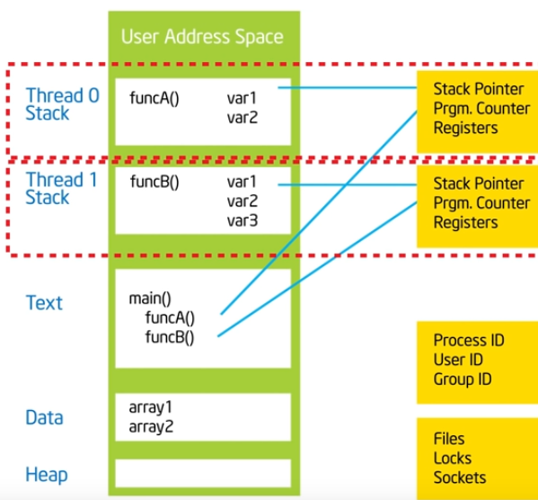

## basics
* SMP (symmetric multi processing) - each block of memory has roughly the same cost
  * last true SMP was cray
  * new cache arch dicatates that new CPUs are not truly SMP - keep in mind the cache hierarchy
* NUMA (Non uninform mem access) - diff mem regions have diff costs. concept of near and far memory.
* with threads the program is fargmented as follows


## example 1

* use SPMD (single program multiple data)
* Notes to self
  - thnk about a specific example and work through it step by step before diving into
  the implementation
  - how many threads is too many? can you allocate an array of that size on the stack?
  - how can you make an incremental improvement first, don't try to optimize everything in one step...you will fail if you do that
* OMP will give you a sensible number of threads, even if you ask for 4000 threads it will only allocate based on what availability
  * so user needs to call `omp_get_num_threads()` to get the actual number of threads
* NOte that parallel program on one thread will be slighly slower than setial program because setting up parrallelization will have some overhead

## False sharing
* when indepedent data sits on same cache line, each update will cause cache lines to slosh back and forth between threads.
* if you promote scalars to an array to support creation of SPMD, the array elements are contiguous in memory and hence
share cache lines. This causes poor scalablity.

## synchronization

1. Barrier
   `#pragma omp barrier` to force all threads to catch up and wait before re-resuming parallel runs

2. mutual exclusion
   Using `#pragma omp critical` and `#pragma omp atomic` will help here


## Loop carried dependencies

* to be able to parallelize a for loop we need to eliminate any depndencies that cause the runs to be effectively serial

Example

```c
int i, j , A[max];
j = 5;
for (i=0; i < MAX; i++)
{
  j += 2;
  A[i] = big(j); // the j is the dependency 
}
```

We can rewrite it this way so we can then make it parallel

```c
int i,  A[max];
const int j_start = 5;
#pragma omp parallel for
for (i=0; i < MAX; i++)
{
  int j = j_start + 2*(i+1);
  A[i] = big(j); // the j is the dependency 
}
```


## resources
* [YT: Intel OpenMP series](https://www.youtube.com/playlist?list=PLLX-Q6B8xqZ8n8bwjGdzBJ25X2utwnoEG)