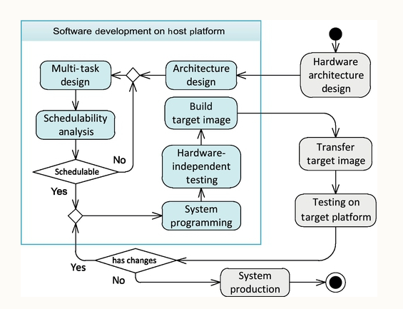

# Overview
Embedded Systems (ES)
* real time constraints important like functional requirements for real-time systems
  * Ex: if GPS correctly computes waypoints but not soon enough, then the information may be useless
* most embedded system (like fridge controller) cannot run debugger, resource constrained
* ES require high reliability. example if system has requirement of 4 nines (99.99% uptime) then even 9s downtime is too much
* efficient utilization of space challenge
* power mgmt - switch to LPM (low power mode) when needed
* host platform = where development occurs. target platform = what we develop for

