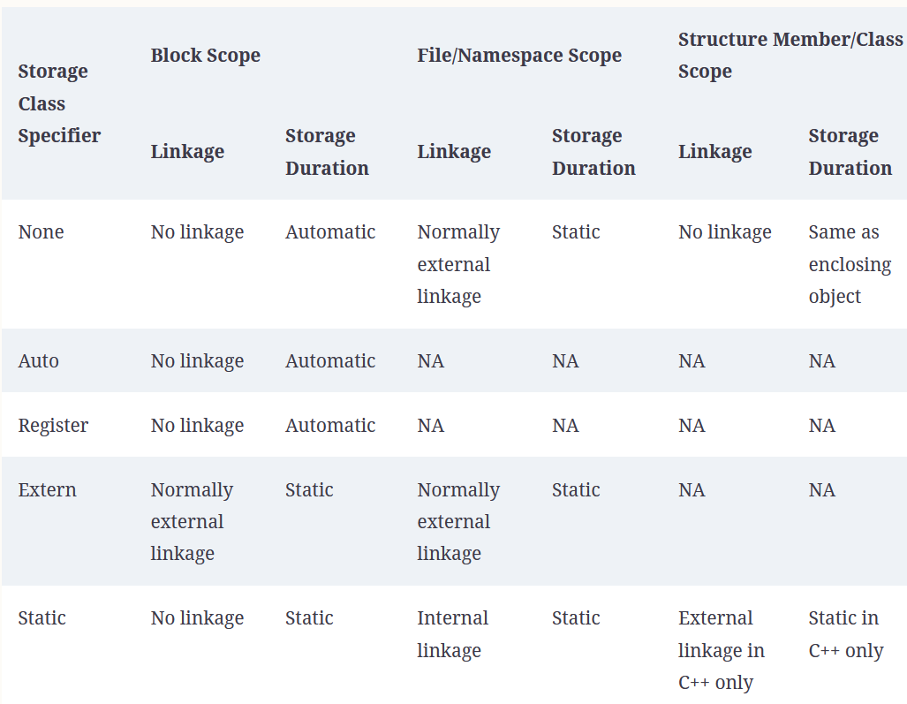
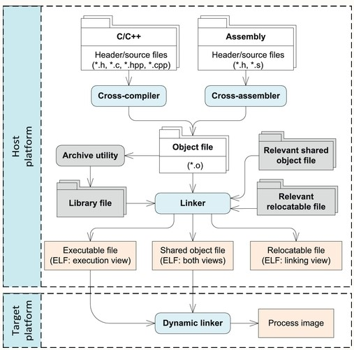
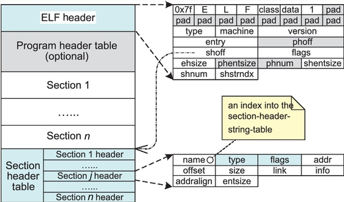

# Overview
Embedded Systems (ES)
* real time constraints important like functional requirements for real-time systems
  * Ex: if GPS correctly computes waypoints but not soon enough, then the information may be useless
* most embedded system (like fridge controller) cannot run debugger, resource constrained
* ES require high reliability. example if system has requirement of 4 nines (99.99% uptime) then even 9s downtime is too much
* efficient utilization of space challenge
* power mgmt - switch to LPM (low power mode) when needed
* host platform = where development occurs. target platform = what we develop for

# hardware arch

* abstraction of the machine which contains microprocessors, memory, peripherals (clocks, controllers, actuators, sensors etc)
* Some common design factors
  * processing power - how fast of a cpu needed? power consumption limits? MIPS per MW
  * mem reqs - what type of RAM, NVM. how much on eval board, how much on target system
  * peripherals - what needed? SOC has many built-in.
    * need debugging iface - serial port
    * perf more imp than cost
  * realibility - how much failure can we tolerate
  * upgrade - how can field upgrades be done

# SW design

* how do diff func modules interact and synchronize
* how many tasks? how to prioritize them? how to document design and timing constraints?
* schdulability analysis - how to schedule tasks

# system programming concepts

## scope regions

* filename/namespace scope - gloabl/file scope when declared in namespace declaration
* func scope
* func prototype scope
* block scope
* class scope

## storage duration

* static - size and addr determined at compile time. Lifetime is for duration of process. Var declared at file/namespace scope.
* automatic - local var at block scope. stored in run-time stack frame of block. Removed when exiting block.
* dynamic - allocation via malloc/new. slower. user has to free/delete to avoid leaks.

## linkage

whether name declarations in diff scopes refer to the same defn. applies to vars and funcs.

* no linkage - declared in block scope/struct/class. can only be referenced within scope. Func params and local vars normally have no linkage.
* internal linkage - name defined in file/namespace scope. can be used within translation unit. outside of the translation unit same name refers to different 

## code  transformation process

* object file contains symbol table
* you can use `readelf`, `nm`, `objdump` commands

read more at https://flint.cs.yale.edu/cs422/doc/ELF_Format.pdf

## linker

* a complete prog consists of multiple object files each of which cross-reference the defns of data or funcs in other object files
* process of combining several object files into a single object file is called static linkage
* linker has two major jobs:
  * symbol resolution - analyze each object file and dtermine where symbols with external linkage defined. two vars with same name
  can be fined in diff scopes. (see example below with `sb`)
  * symbol relocation - final object contains all symbols from input src and static libs. as linker merges object files from src and adds lib refs, the symbol offsets changed. via relocation table modifies binary code of final obj file so each symol reflects the actual addr assigned to symbol.

Using this example

* both one.c and two.c define sb. Both of these are independent and represent two different values. compiler uses namespace
to distinguish vars. local var is tagged by func to which it belongs and a global by filename.

* linker generates 3 kinds of obj files
  * relocatable file. holds code and data for linking with other obj files to create exec or so.
  * executable file. holds code and data for exec. in OS basic unit called process. process image dynamically
  created from executable file on `spawn` or `exec` calls. each process put in its own addr space/vm.
  * shared object file. holds code and data suitable for further linking. can be combined with other relocatable and so to create 
  another obj file. some so are dynamically linkable, loaded at runtime and shared by many processes.

## dynamic linker

* program loader can load executables and run them
  * standalone executable can contain copy of each lib routine needed
  * but this costs memory
* another type of program can have only references to lib routines
  * requires the shared libs exist on target
  * and needs a dynamic linker - a program interpretor more powerful than a regular program loader
  * a dyn linker, take control and will load whole program to form initial process image, then
  resolve symbols dynamically loading and binding external shared libs to form a complete process image,
  and finally transfer control to process. this is called dynamic linking.
  * adv is that each process need not maintain copy of libs and upgrades to lib can be available to all processes
  * but the processes have a dependency and version diffs may issues if a process cannot handle a specific lib version

## elf format

* elf object has several headers. ELF header is like a roadmap. see details at https://en.wikipedia.org/wiki/Executable_and_Linkable_Format

* the image above is "linking view", there is also an execution view