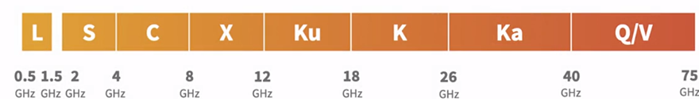

## Basics
Commonly used bands are C, Ka and Ku

* A sat comm system has three segments:
  1. space segment - sats can talk to each other via intersat links
    - satellite contains payload which has antennas to talk to ground
    - intersat links can be radio or optical
  2. ground segment
    - gateway stations connected to internet on ground
    - vsat (very small aperture) stations are used by laptops on ground to talk to satellite
  3. control segment
    - facilities on ground for tracking, telemetry and command (TTC) and network mgmt station

  ## LEO

  - low latency, increaed tput
  - enables large data xfer in less time
  - prevents jamming attacks?
  - redundancy in sat constellation for secure and reliable comms
  - capacity compareable to fibre optic cables???
  - gateway stations deal with handover between satellites

* since satellite internet can have interference from other services such as TV broadcasting
operators using EHF (extremly high freq) bands (Ka, Q/V) to support higher tput
  - but these are more suspecitble to weather, so need multi-antenna
