<!-- vscode-markdown-toc -->
* 1. [Intro](#Intro)
* 2. [circuit switching vs packet switching](#circuitswitchingvspacketswitching)
* 3. [message tx methods](#messagetxmethods)
* 4. [Terms to understand](#Termstounderstand)
* 5. [perf metrics](#perfmetrics)
* 6. [OSI model](#OSImodel)
* 7. [L4 (transport)](#L4transport)
* 8. [PPP - point to point protocol](#PPP-pointtopointprotocol)
	* 8.1. [PPP LQM and LQR](#PPPLQMandLQR)
	* 8.2. [PPP compression control protocol (CCP)](#PPPcompressioncontrolprotocolCCP)
	* 8.3. [PPP encryption control protocol (ECP)](#PPPencryptioncontrolprotocolECP)
	* 8.4. [PPP multilink protocol (MP)](#PPPmultilinkprotocolMP)
* 9. [Extensible authentication protocol (EAP)](#ExtensibleauthenticationprotocolEAP)
* 10. [ARP](#ARP)
	* 10.1. [MAC addresses](#MACaddresses)
* 11. [IPv4](#IPv4)
	* 11.1. [IPv4 addresses](#IPv4addresses)
	* 11.2. [subnetting](#subnetting)
* 12. [CIDR prefixing](#CIDRprefixing)
* 13. [IPv4 packet](#IPv4packet)
* 14. [IPv4 vs IPv6](#IPv4vsIPv6)
* 15. [IPv6 addressing](#IPv6addressing)
* 16. [ip address allocation](#ipaddressallocation)

<!-- vscode-markdown-toc-config
	numbering=true
	autoSave=true
	/vscode-markdown-toc-config -->
<!-- /vscode-markdown-toc -->

##  1. <a name='Intro'></a>Intro
* protocols have header and trailer (happens to frames)
* this is metadata that is needed to transport data

##  2. <a name='circuitswitchingvspacketswitching'></a>circuit switching vs packet switching
* instead of fixed and dedicated paths (like in circuit switching), we break data into packets
* packets can take different paths based on things like congestion, outages etc.

##  3. <a name='messagetxmethods'></a>message tx methods

1. unicast
* point to point

2. broadcast (not for IPv6 - instead uses multicast groups)
* one entity sends packets to all receivers

3. multicast
* one entity sends packets to a group (which some receivers joined)

4. anycast (IPv6 only)
* send datagram to nearest node

##  4. <a name='Termstounderstand'></a>Terms to understand
* simplex - public one way comms 
* half duplex - two way comms, but one party can talk at a time. a walkie-talkie. ham radio. wireless networks. ethernet hub.
* full duplex - a conversation between two people.
* intranet - internal network within networks
* extranet - you connect your network to a customer/vendor. special use.
* PAN: personal - bluetooth, LAN, WLAN, CAN (campus area nw), MAN (metropolitan area net), WAN (wide area net)

##  5. <a name='perfmetrics'></a>perf metrics

##  6. <a name='OSImodel'></a>OSI model

see https://en.wikipedia.org/wiki/OSI_model

* PDU - protocol data unit (the packaged data received from layers above or below)
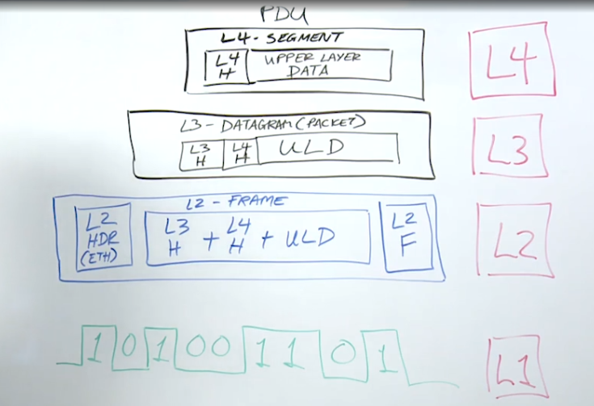

* L2/ethernet has a header and footer. the footer has a checksum in it. 

##  7. <a name='L4transport'></a>L4 (transport)

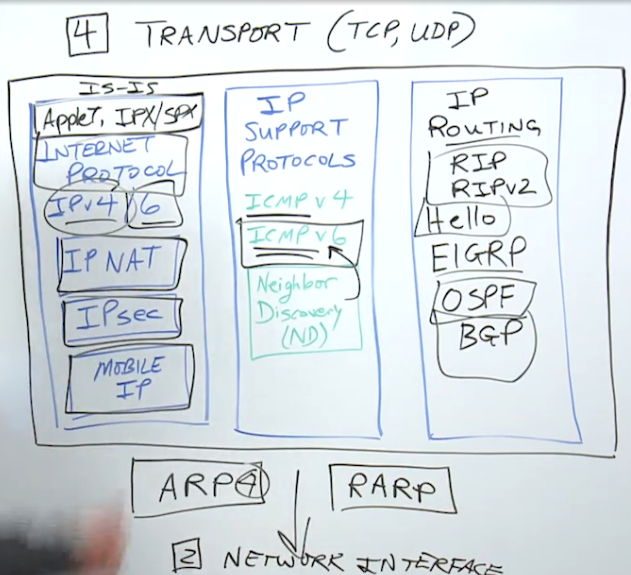

* In V6, NDP takes care of the work ARP did in IPv4
* IP => **routed protocol**
* RIP/Hello/EIGRP/OSPF(open shortest path first)/BGP(border gateway protocol) => **routing protocols** NOTE the distinction. forward IP datagrams from one device to another.

##  8. <a name='PPP-pointtopointprotocol'></a>PPP - point to point protocol

* SLIP (Serial line internet protocol) is the predecessor
  * for TCP/IP over physical link when there is no layer2 protocol
  * fills gap between physical layer 1 and IP layer 3
  * RFC 1055 - published but did not become standard

* PPP RFC 1661, 1662, 2153
  * developed to address shortcomings of SLIP such as no compression, no security, no error corrections etc
* link layer
* popular to carry datagrams over serial lines (DSL). stream of bits.
* links established using LCP (link control protocol)
* a family of NCP(network control protocols) establish network links after LCP sets up basic connection

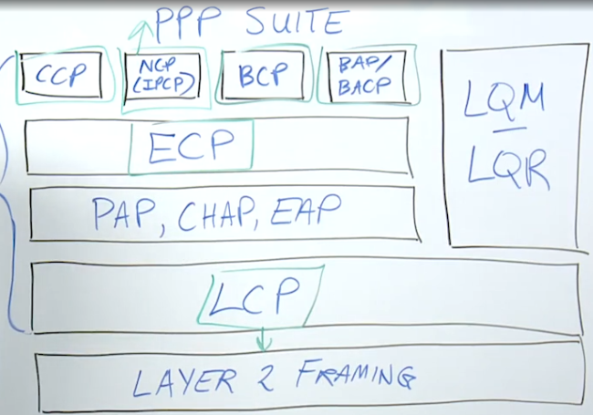

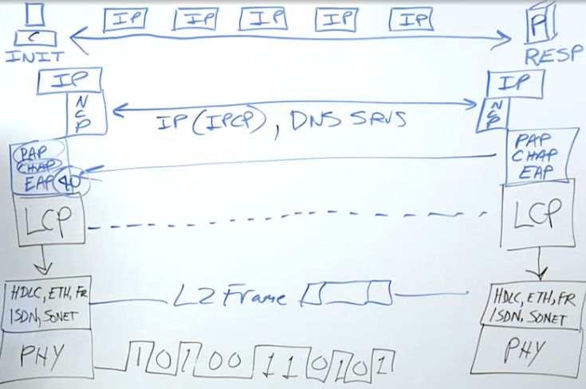

###  8.1. <a name='PPPLQMandLQR'></a>PPP LQM and LQR
* PPP and TCP have methods for error detection and corruption checking
* Link Quality monitoring (LQM) let's devices analyze link quality
* LQR (reporting) requests other device on link track stats report peridically (send me a link report from your end)
  * ex: num frames sent/recvd per sec

###  8.2. <a name='PPPcompressioncontrolprotocolCCP'></a>PPP compression control protocol (CCP)
* optional way to cpmpress data
* defines compression scheme to be used by hosts
* separate algos for compression/decompression

###  8.3. <a name='PPPencryptioncontrolprotocolECP'></a>PPP encryption control protocol (ECP)
* typically IPSec or SSL/TLS
* optional and seldom used

###  8.4. <a name='PPPmultilinkprotocolMP'></a>PPP multilink protocol (MP)
* sometimes you need more L1 connectiosn for higher bandwidth
* optional

##  9. <a name='ExtensibleauthenticationprotocolEAP'></a>Extensible authentication protocol (EAP)
* commonly used
* 40 methods
* used for wired and wireless nets
* initial EAPOL protocol
* transport level security, one-time passcode 

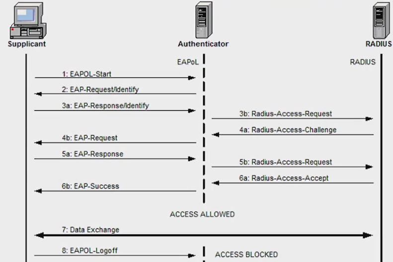

TBD - look into certificates X.509 etc

##  10. <a name='ARP'></a>ARP

* we need a more humane way to identify servers instead of using addresses, hence the need for DNS
* used for IPv4
* maps IP addr to mac
* types of message sent
  * ARP request
  * arp reply
  * Rarp request
  * RARP reply
* resolved addresses usually cached for a little while (see ARP cache poisoning and why they need to be flushed periodically)

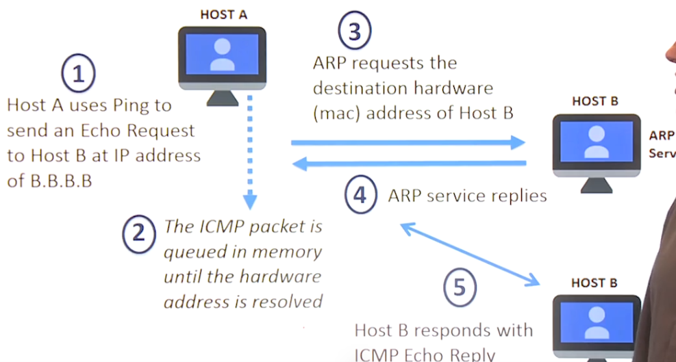

###  10.1. <a name='MACaddresses'></a>MAC addresses
* 48 bit
* typically tied to a net interface card (NIC)
* macc addr can be physical or it can be logical (i.e. for a virtual adapter on a virtual VM like you may use at a Cloud service provider)

##  11. <a name='IPv4'></a>IPv4

* core protocol of L3
* main purpose is to provide datagram delivery
* L3 devices: routers, multilayer switches, load balancers, firewall appliances

* IP works with ehternet and wireless 802 family
* tcp at L4 is a connection-oirented protocol, but IP is connection less. no reliable delivery.
* formatting and packaging of upper layer sdu.
* fragmentation and reassembly. if you are going from a network with larger MTU then you need to break up the packets.
* routing and internet delivery
  * help from ICMP, BGP et al

###  11.1. <a name='IPv4addresses'></a>IPv4 addresses

* possible ~ 4.3 billion address spae. most space is for unicast addressing. some more multicasting.
  * public addresses
  * private addresses rfc 1918
* classes of addresses are A,B,C,D,E
* dotted quad respresentation
  * each quad is an octet (8 bits)
```
255.255.0.0 --> subnet mask
1.2.3.4
10.0.0.255/24 --> first 24bits are the network
in this case 255 means directed broadcast so this datagram is sent to every host on the 10.0.0 network
but most routers will not allow this kind of address since it can be used in exploits
But you can use 255.255.255.255 for broadcast

```

This is the tradional "classful" way that addresses were classified
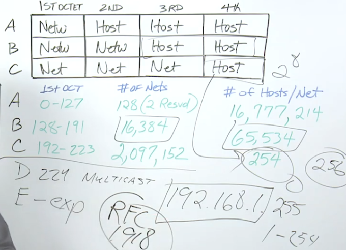

FOr private addressing in LANs we have these
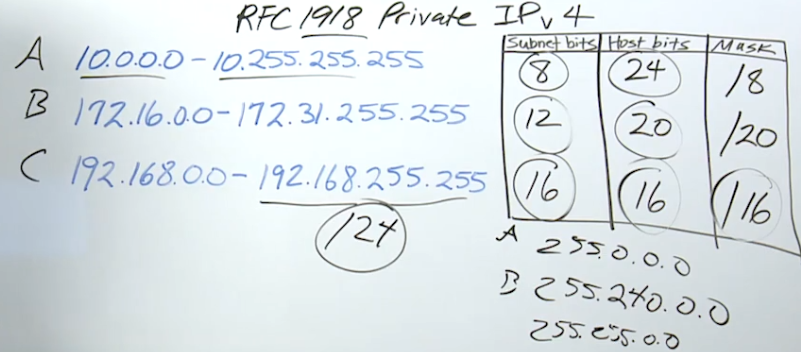

With CIDR things get easier -> classless 

###  11.2. <a name='subnetting'></a>subnetting

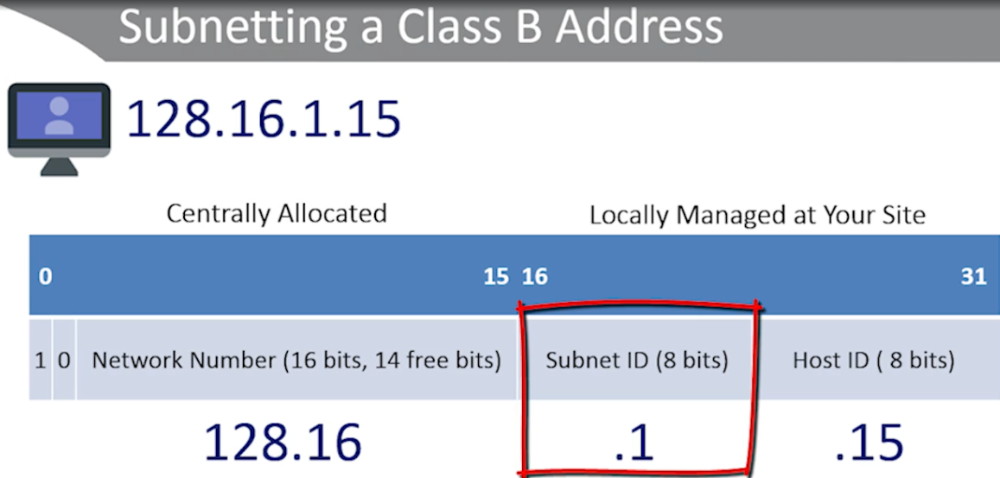

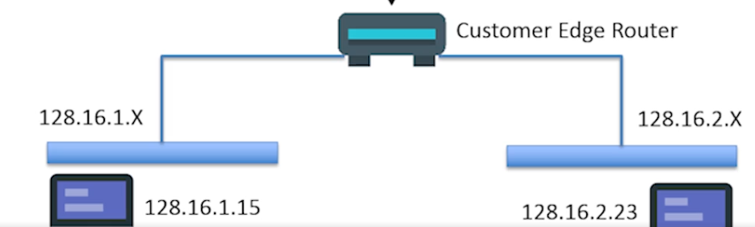

* subnet mask for v4 is 32 bits and 128 bits for v6
* can be assigned manually or via DHCP

* see https://www.packetcoders.io/a-beginners-guide-to-subnetting/
https://stackoverflow.com/questions/54035601/calculate-subnet-bits-and-host-bits

##  12. <a name='CIDRprefixing'></a>CIDR prefixing

* eliminates the prefefined partitioning of the net and host part of address

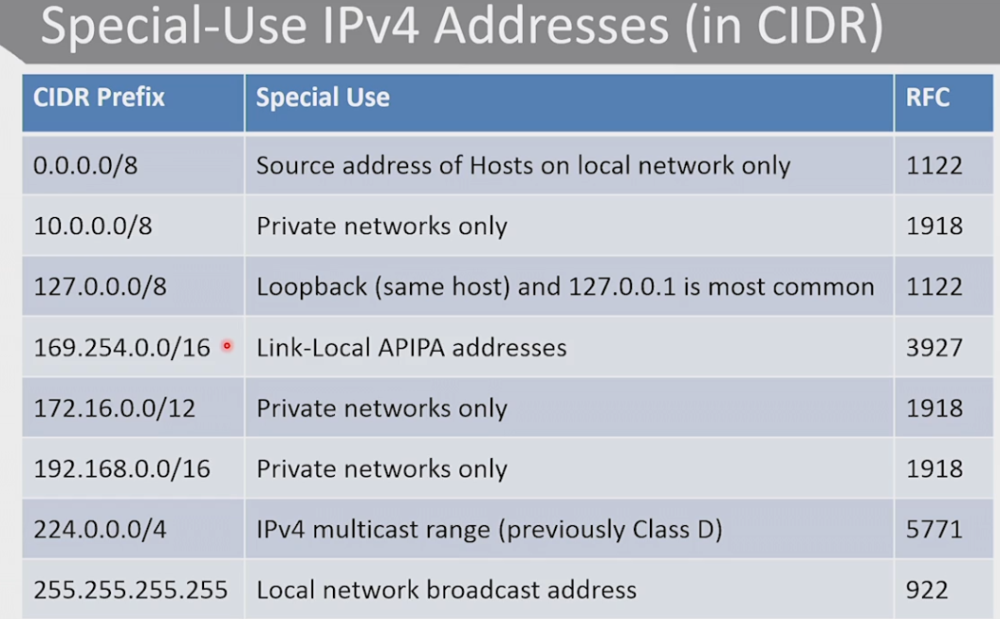

##  13. <a name='IPv4packet'></a>IPv4 packet

see https://en.wikipedia.org/wiki/Internet_Protocol_version_4#Packet_structure


##  14. <a name='IPv4vsIPv6'></a>IPv4 vs IPv6

tbd - why we need it, advantages like smaller header, more address space etc.

* IP sec is part of IPv6, no longer optional

##  15. <a name='IPv6addressing'></a>IPv6 addressing

* Format is X:X: ... :X where each X is a hextet (16 bits)
* total 2^128 bits
* ALso you can leave off leading bits when 0 such as `::01cd` or `::1cd`
* unspecified address is `::`
* types of addresses
  1. unicast - used for one-to-one addressing between hosts
  2. multicast - identifies group of interfaces. traffic sent to multiple dests at the same time. an interface can be part of many multicast groups.
  3. anycast - ipv6 anycast addr is assigned to an interface on more than one node. routed to nearest iface that has this addr. used for something like group encrypt transport vpn.
  4. no broadcast support. use multicasting.

* ipv6 address has scope. which designates the region in which addr is valid. loop back addr has link-local scope, so it should only be used in directly attached network.
* three scopes
  1. link scope
  2. site network scope
  3. gloabal network scope

* unicast addr uses 64 bits for net id and 64 bits for host id
  * net id can be assigned by admin or autoconfigured using SLAAC (which uses MAC address as part of the process of generating the full ip address)
  * gloabl unicast address of format `2000::/3`

##  16. <a name='ipaddressallocation'></a>ip address allocation

* You can do it manually, using DHCPv6 (stateful) or SLAAC (stateless)
* SLAAC uses neighbor discovery to find routers and then dynamically create ipv6 addr
  * uses ICMPv6


## ICMP

* IP is unrealiable so ICMP is the feedback mechanism
* resides between L4 and L3
* many border routers and firewall will block icmp messages since they can sometimes be used for attacks
* ping is a icmp request and reply application: verifies reachability, RTT, packet loss
* traceroute another tool which uses echo request/reply
  * helps find congestion and where packet dropped


